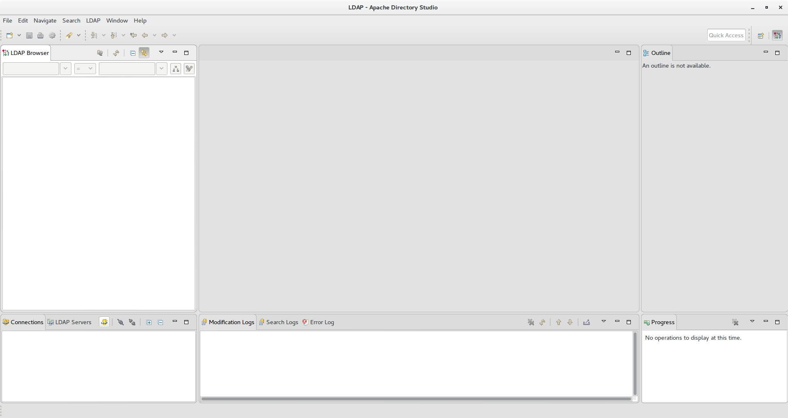
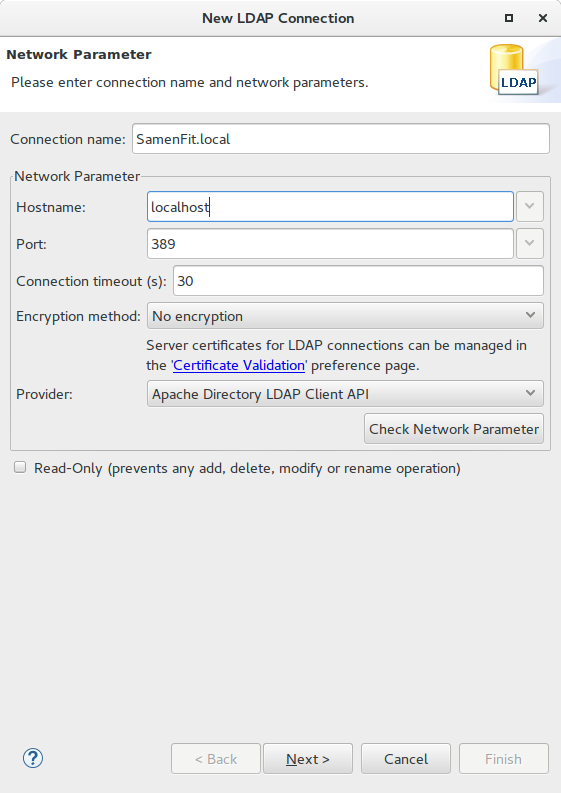
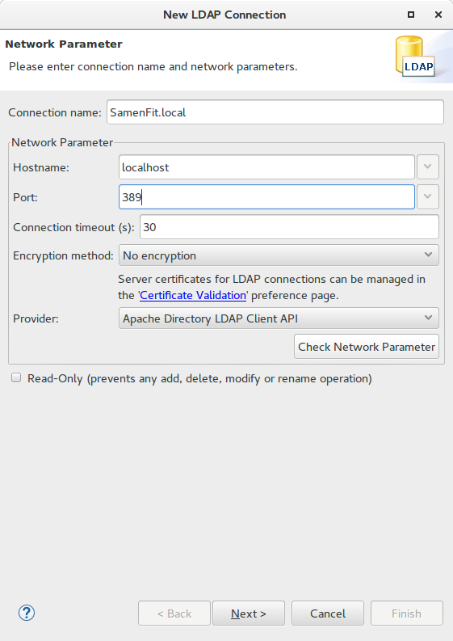
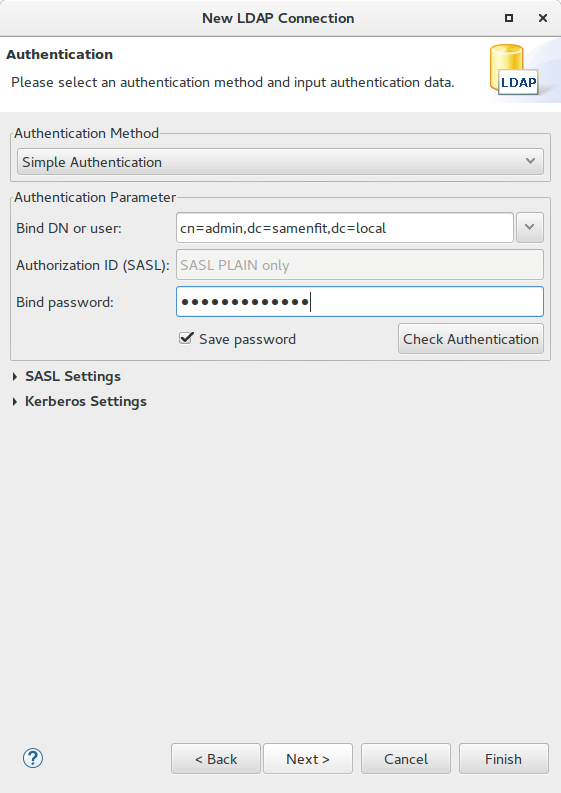
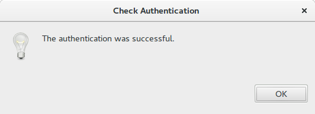
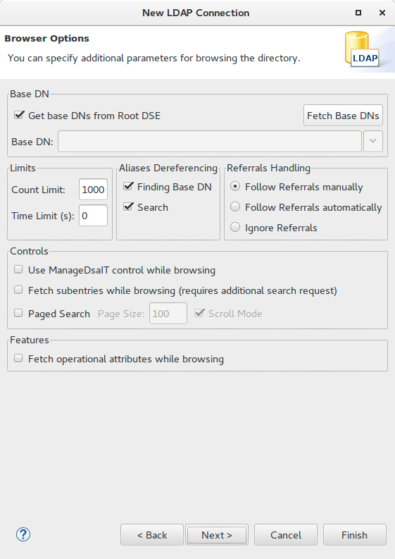
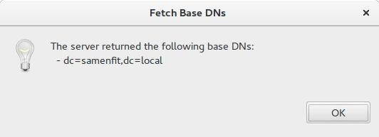
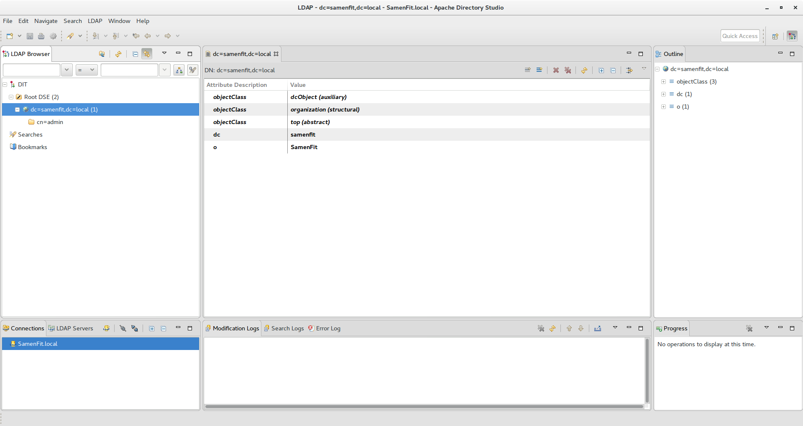
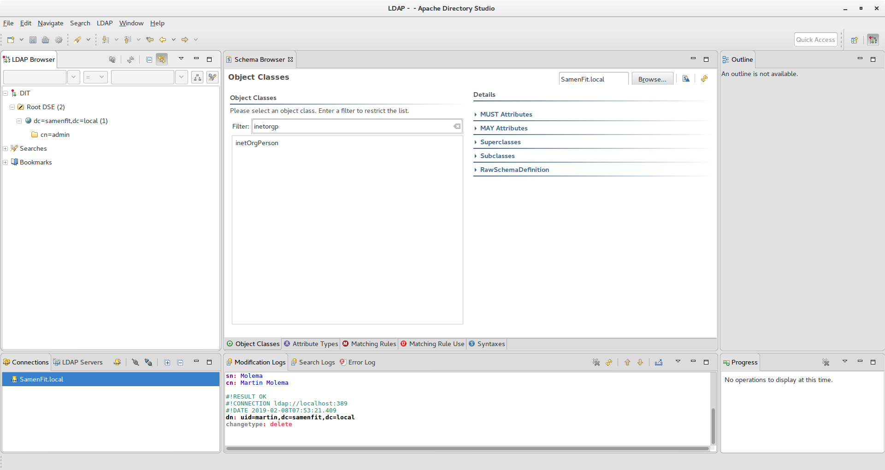

# Configuratie Apache Directory Studio for LDAP

Installatie volgens [deze](https://directory.apache.org/studio/) handleiding.

## Stap 1: Aanmaken nieuwe verbinding
Als je Apache Directory Studio hebt gestart krijg je na het welkom scherm onderstaande afbeelding: 

Ga naar het menu, en klik op `LDAP` en dan `New Connection`. Er wordt een dialoogvenster geopend:

Vul de gegevens in zoals weergegeven:
  * Connection name mag je zelf weten
  * Hostname = localhost óf het IP-adres van je Virtuele Machine (bijv. 10.0.0.2 of 192.168.1.45)
  * Port = 389
  
Druk vervolgens op de knop 'Check Network Parameter' om te kijken of de LDAP-service bereikt kan worden. Als dat lukt krijg je onderstaande bevestiging: 

Druk op `Next` om naar de volgende stap te gaan. 

In de volgende stap gaan we inloggen op de LDAP-service met het **Admin**-account. Let op: als je hier het wachtwoord opslaat kan iedereen dus 
als admin inloggen zonder wachtwoord op te geven!

Echter, voor het testen van je configuratie is het wel nuttig om nu even het wachtwoord opslaan aan te zetten, zodat we in dit dialoogvenster kunnen testen.

Voer de gegevens in:
  * Bind DN or User: `cn=admin, dc=samenfit, dc=local`
  * Bind password : je wachtwoord dat je bij installatie gebruikt hebt.
  
Let op: bij de **Bind DN**  moet je de domein-naam die je gekozen hebt tijdens de installatie gebruiken. Stel, je kiest voor de domeinnaam 'bedienopafstand.local' dan wordt de Bind DN:
  * `cn=admin, dc=bedienopafstand, dc=local`

Druk vervolgens op de knop 'Check authentication'. Je krijgt onderstaande bevestiging:

Druk op `Next` om naar de volgende stap te gaan. 

We gaan nu de DIT (Directory Information Tree) uitvragen: welke basis DN's zitten er in de root van de tree? 

Klik in bovenstaande afbeelding op de knop `Fetch BaseDN's`. De dropdown-lijst links van deze button wordt nu ververst. 

Zet daarna het vinkje uit bij `Get Base DN's from Root DSE` en kies in de dropdown-lijst je domeinnaam. Druk net zo lang op `Next` tot de wizard klaar is. Je komt dan in onderstaande scherm uit:

## Check op geinstalleerde schema's
Om later gebruikers op te kunnen voeren, maken we gebruik van onderstaande schema's:
  * ObjectClass = inetOrgPerson
  * ObjectClass = organizationPerson
  * ObjectClass = person
  * ObjectClass = top
  
Als het goed is zijn deze al geinstalleerd. Je kunt dit checken in de Schema Browser: 
`LDAP Directory Studio --> Menu-->LDAP-->Open Schema Browser`

Type bij de zoekbalk `inetOrgPerson` in en je ziet als het goed is het schema in de zoekresultaten verschijnen. 

Voor het maken van groepen maken we gebruik van een `ObjectClass = groupOfUniqueNames`.  Check dat deze bestaat.
