# Configureer LDAP via Apache Directory Studio en command-line (Bash)
In deze handleiding zitten de volgende onderdelen

1. [Aanmaken Organisational Unit](./README.md#opvoeren-gebruikers-en-groepen---organizationalunit)
2. [Aanmaken groepen](./README.md#opvoeren-gebruikers-en-groepen---usergroups)
3. [Koppelen gebruikers en groepen](./README.md#koppelen-gebruikers-aan-groep)
3. [LDAP netjes Beveiligen](./README.md#ldap-beveiligen)
 
Testen door middel van een GUI gaat met de Apache Directory Studio. Je kunt deze op je Windows PC installeren 
of op je virtuele machine. Als je via je WIndows PC naar de LDAP-service wilt verbinden, 
zorg dan dat je Port-forwarding aanzet voor poort 389 op je VM-configuratie. Zorg dat je verbinding kunt maken naar je
 VM via het netwerk (zie [deze](../Netwerk/README.md) installatie handleiding).

[Apache Directory Studio](https://directory.apache.org/studio/downloads.html)

Voor een installatie handleiding klik je [hier](../ApacheLDAPStudio). 

Om de versie te controleren van je LDAP-service, klik je op de server-configuratie links onderin. 
Met de rechter muisknop open je het lokale menu, en vraag de `properties` op via dat menu. Klik vervolgens het uitklap menu
open onder `Connection` (linker paneel) en klik op de `Root DSE`. Je ziet het versienummer ('Directory type' = 2.4) wat kan
helpen bij het nalopen van problemen. 
 
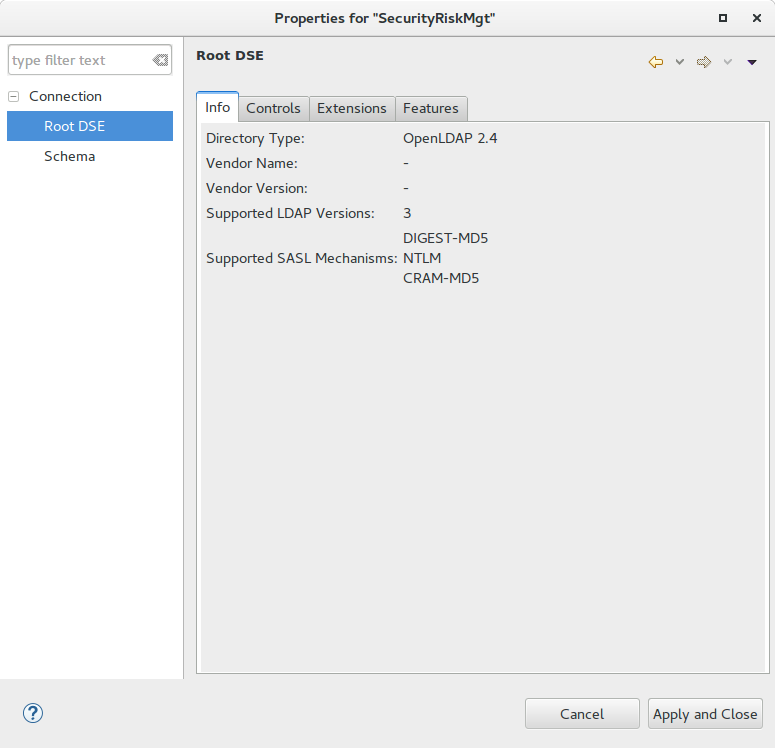

# Opvoeren gebruikers en groepen - OrganizationalUnit
Het is niet gebruikelijk om de in root van je LDAP-tree meteen gebruikers en groepen te maken. Dus maak eerst OrganisationalUnits (OU) . Bijvoorbeeld een OU voor de interne organisatie. 

Ga naar het menu, dan `LDAP` en `New Entry`. Zorg dat de root-node `dc=Samenfit,dc=local` geselecteerd is.  Doorloop de wizard en vul de juiste gegevens in:


Type bij `Available object classes` de tekst `Org` en er verschijnt een verkorte lijst. Kies voor `organizationalUnit` en klik op de `Add` button. 


Het scherm ziet er dan uit zoals hier onder. 


Klik op `Next` om verder te gaan. We gaan nu de attributen invullen. Elk object heeft een attribuut dat bepaald hoe het in de tree geplaatst moet worden. We noemen dit de [RDN](https://ldap.com/ldap-dns-and-rdns/)


Herhaal deze stappen voor het aanmaken van een ORganizationalUnit voor de Users:

`ou=users, ou=Samenfit, dc=samenfit,dc=local`

Selecteer dus eerst de net aangemaakte `OU=Samenfit`, kies uit het menu `LDAP-->New Entry`. Dit resulteert in 
onderstaande structuur:

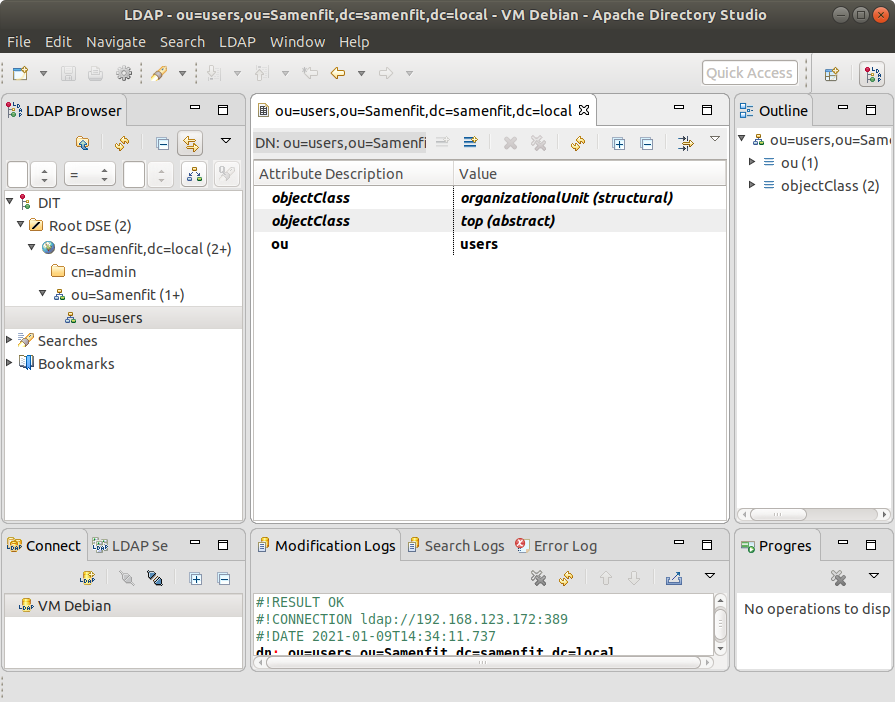

## Opvoeren gebruikers en groepen - usergroups
Om rechten uit te geven is het vaak handig om gebruikers in groepen op te nemen. De volgende stap is dus het aanmaken van een gebruikersgroep.  Hiervoor maken we eerst op een wat slimmere manier een nieuwe OU. 

Selecteer eerst de eerder gemaakte OU en klik met de rechter muisknop op deze OU, en kies uit het lokale menu 'New Entry':

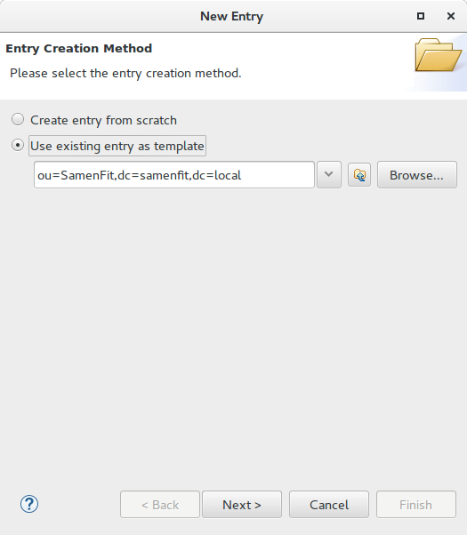

Merk op dat we nu een template gebruiken van de zojuist geselecteerde OU. Nu kunnen we sneller door de wizard heen. 


Vergeet niet de RDN aan te passen! Noem deze OU `groups`. 

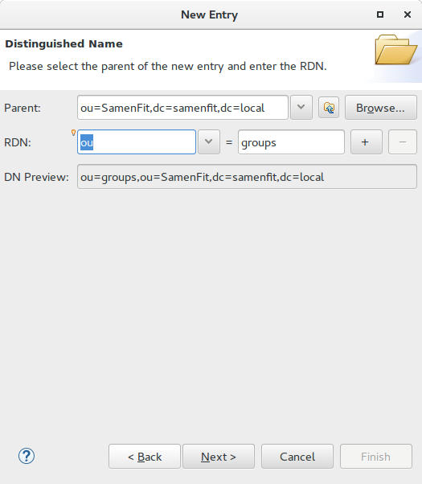


Klik op `Finish` om de wizard af te ronden. 

## Aanmaken groep 
De volgende stap is het maken van een Groep. 

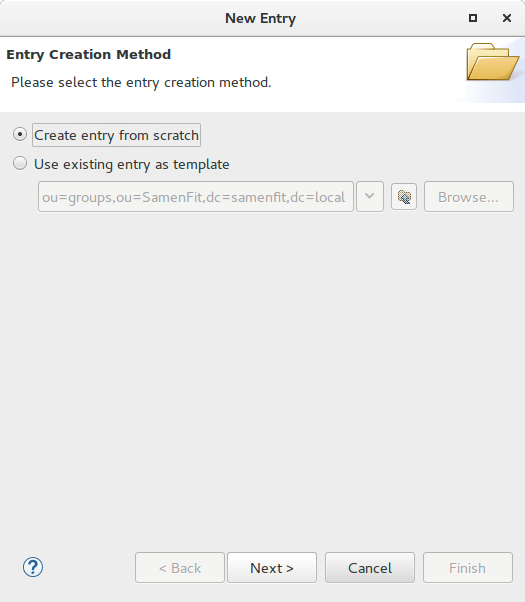


In het laatste scherm laten we het attribuut `uniqueMember` voorlopig leeg.


## Maken van een gebruiker
We gaan nu een nieuwe gebruiker aanmaken. We maken een gebruiker door een object te maken van de 
`objectClass = inetOrgPerson`. Belangrijk om te weten is dat we na afloop van het doorlopen van de wizard
nog een aantal extra attributen moeten aanmaken, te weten:
  * `userPassword` : het wachtwoord
  * `uid`: de gebruikersnaam
  * `sn`: de achternaam (`surname`)
  
Als RDN gebruiken we het attribuut `CN` (CanonicalName). Selecteer eerst de juiste plek om de gebruiker 
aan te maken: 

`ou=users,ou=samenfit,dc=samenfit,dc=local`

We krijgen dan de volgende informatie:
   
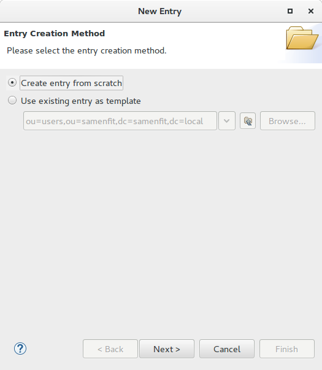


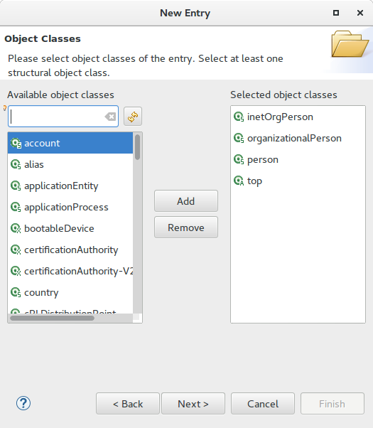


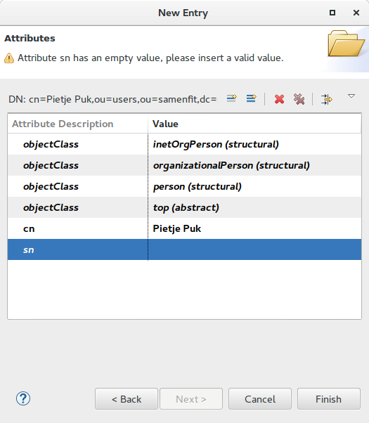

Je kunt eventueel nog de givenNaam (voornaam) invoeren. 
VOeg een nieuw attribuut toe:
  * Selecteer de nieuwe gebruiker
  * Menu-->LDAP-->New Attribute
  * Kiezen als attribuutnaam `New Attribute`.
  


## UserID Toekennen
Voor de meeste situatie is het handig als je het attribuut UID gebruikt voor het toekennen van de daadwerkelijke
gebruikersnaam. Maar dus een nieuw attribuut 'UID' en voer daar een gebruikersnaam aan toe. Let op dat het niet gebruikelijk
is om daar spaties en bijzondere tekens in te verwerken! In het attribuut CN is dat meestal niet zo'n probleem.

VOeg een nieuw attribuut toe:
  * Selecteer de nieuwe gebruiker
  * Menu-->LDAP-->New Attribute

Kies vervolgent het UID attribuut:
  
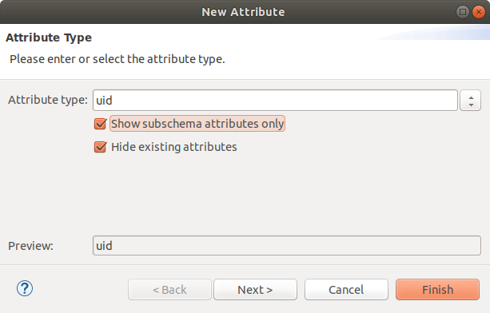

Laat in het volgende scherm de situatie zoals die is:
 
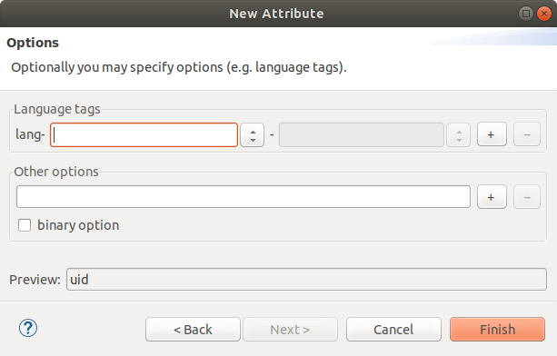
 
 Druk op `Finish` en je komt terug bij de gebruiker waar je het user-id kunt invoeren. 
 
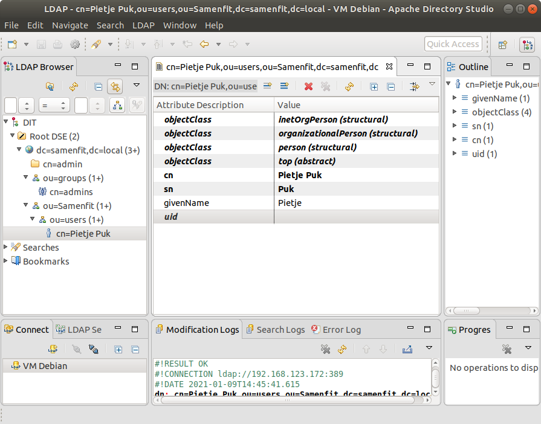
 
 In dit geval is gekozen voor de username  `pietjepuk`.
 
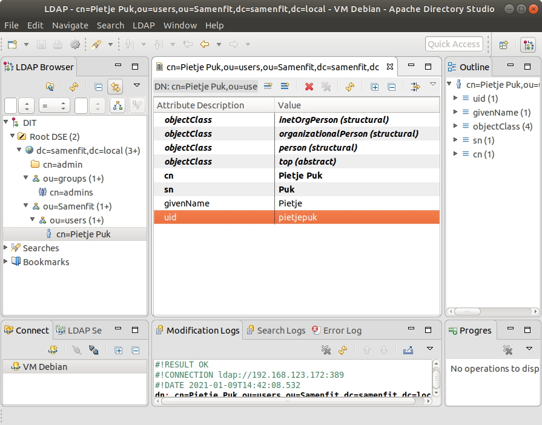 

## Wachtwoord opvoeren

Daarna voeren we het attribuut `userPassword` op. Na het aanmaken krijg je meteen een dialoogvenster om het wachtwoord in te voeren.

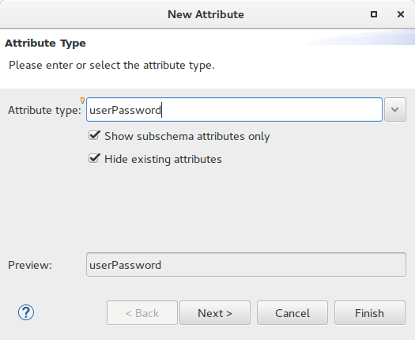

**Let op**: je kiest hier voor CRYPT-SHA-265 en niet voor SHA-256. Deze laatste staat je wel toe om een wachtwoord op te voeren
maar niet meer om er verbinding mee te maken. Zie [verderop](#wachtwoord) voor een testprocedure

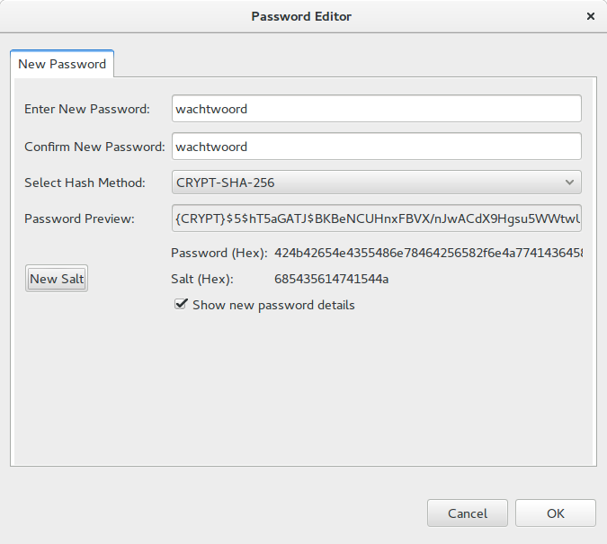


## Testen juist wachtwoord
<A name="wachtwoord"/>
Als je een wachtwoord en encryptie hebt gekozen, test dan je wachtwoord. Dat gaat als volgt:

  1. Zoek de gebruiker op in de DIT (*Directory Information Tree*)
  2. dubbelklik op het attribuut `userPassword` om het dialoogvenster van het wachtwoord te openen
  3. voer bij het veld `Verify Password` je wachtwoord in van de gekozen user
  4. zet de vinkjes aan bij `Show current password details` en `Show test password details`
  5. Klik op `Verify` om je wachtwoord te testen

Je weet nu of je wachtwoord juist is. De volgende stap is bedoeld om je te testen of je dat wachtwoord
ook kunt gebruiken om een `LDAP bind` te doen. Lukt dat niet, dan kun je de gekozen wachtwoord versleuteling
niet gebruiken. 

  1. Druk op de knop `Bind`
  2. als je een foutmelding krijgt is de gekozen versleuteling niet juist.
  3. als je een bevestiging krijgt, dan kun je met deze user verbinding maken
  
**Let op**: Dit geldt zowel voor de gebruiker die in je `apache config` hebt staan (AuthLDAPBindDN) 
als voor gebruikers die willen inloggen via jouw website op een beveiligde map. 

Hieronder nog de schermafdrukken:

selecteer gebruiker

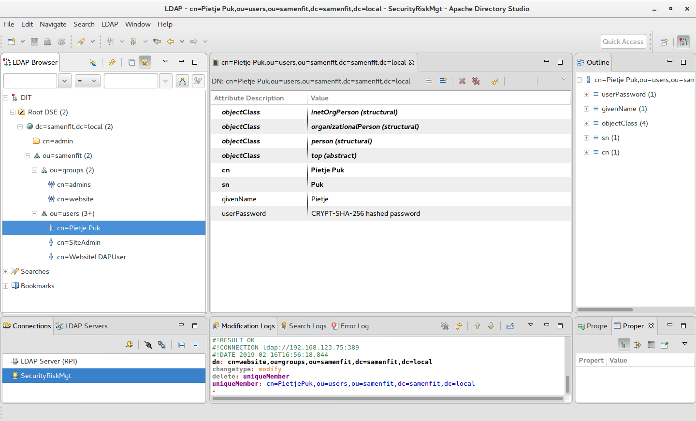

Password editor

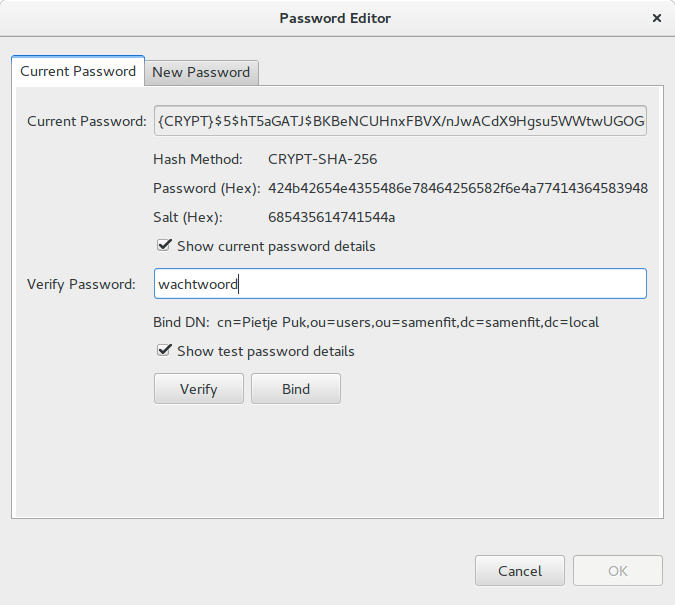

wachtwoord verificatie

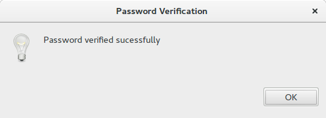

bruikbaarheid wachtwoord voor `ldap-bind`

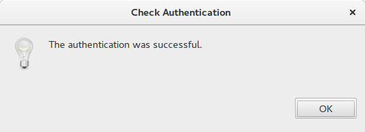


## Koppelen gebruikers aan groep
Nu we gebruikers hebben gemaakt, kunnen we ze aan groepen koppelen. We gebruiken het attribuut `uniqueMember`
dat een zogenaamd `multivalue` attribuut is. Dat betekent dat het vaker mag voorkomen bij een object. Handig!
Zo kunnen we dus eenvoudig meerdere gebruikers in een groep koppelen. 

Dat gaat vrij eenvoudig:
  1. ga naar de DIT (Directory information tree) links
  2. selecteer de gebruiker die je in een groep wilt toevoegen
  3. kopieer deze gebruiker (met bijv. Ctrl+C)
  4. selecteer de groep waar je deze gebruiker aan wilt toevoegen
  5. selecteer het lege attribuut `uniqueMember`
  6. druk op plakken, en zie dat de `DN` (DistinguishedName) tevoorschijn komt.
  7. Druk op `Enter` om te bevestigen
  
Wil je nog een gebruiker toevoegen? Herhaal dan stappen 1 t/m 4. Ga vervolgens hieronder verder:
  1. selecteer het attribuut `uniqueMember`
  2. ga naar het menu-->LDAP-->Add value , of gebruik de rechter muisknop op het attribuut `uniqueMember`
  en kies  `Add Value`.
  3. plak de `DN` in het nieuwe attribuut.

  
Uiteindelijk ziet dat er als volgt uit:

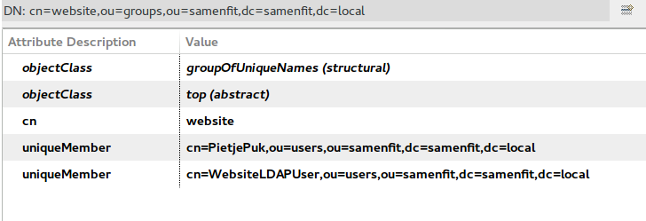

Maak nu meerdere gebruikers aan en stop deze in de juiste groepen. Het idee is dat je op basis van groepen
andere toegangsrechten in je website / Apache Webserver kunt toekennen.

# Maak een gebruiker voor je applicatie
We willen geen verbinding maken via de admin-user vanuit ons programma dat later in PHP
geschreven gaat worden. Daarom maken we een speciale user aan die toegang krijgt 
tot de LDAP (zie [verderop](./README.md#ldap-beveiligen)).

De username van deze user : `webuserldap`. We maken deze aan in de volgende locatie:

`ou=users,ou=Samenfit,dc=samenfit,dc=local`

Kies zelf een sterk wachtwoord en onthoud dit om later toegang te krijgen vanuit je broncode.

Uiteindelijk moet het er zo uit zien:

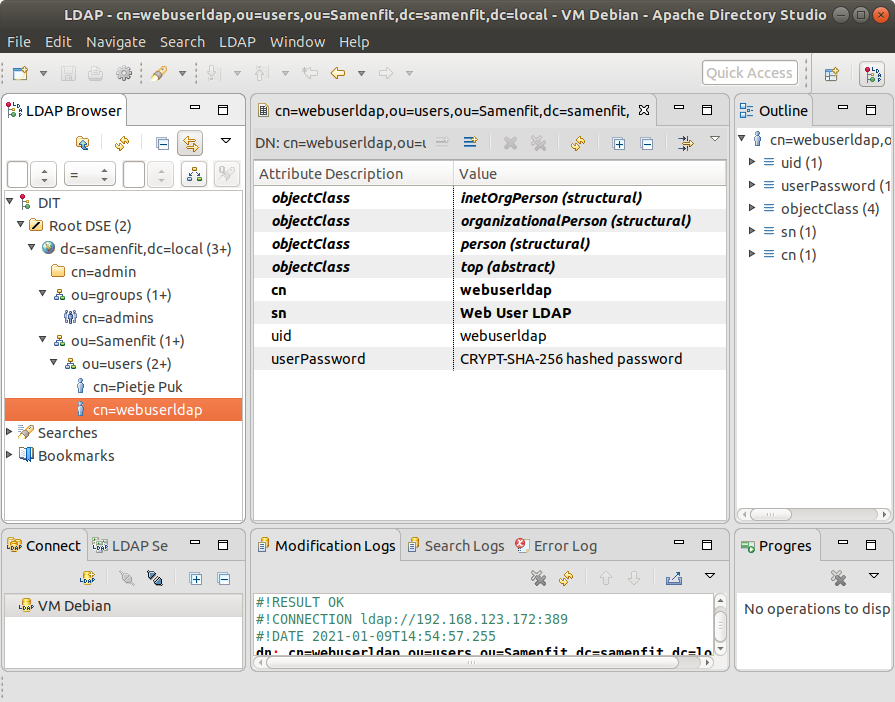

  * uid = webuserldap
  * userPassword = CRYPT-SHA-256
  * cn = webuserldap  

# LDAP beveiligen
Nu hebben we de LDAP zaken op orde, maar moeten we nog voorkomen dat we met de *admin*-account alle wijzigingen 
moeten doen. Daarom gebruiken we de nieuwe users `webuserldap` om deze rechten te geven om dit te doen. Daarvoor 
moeten we zogenaamde ACL's (*Access Control List*) opvoeren. Zie voor uitgebreide informatie de link onderaan.  

Dat gaat via het commando `ldapmodify`.

Eerst moeten we kijken wat de huidige stand van zaken is. Dat gaat met `slapcat`. Er volgt dan zeer veel informatie. We 
zijn op zoek naar `dn: olcDatabase={1}mdb,cn=config`. Vervolgens staan er een aantal `olcAccess`-regels.

```
$ slapcat -n 0 
[............snip................]
dn: olcDatabase={1}mdb,cn=config
objectClass: olcDatabaseConfig
objectClass: olcMdbConfig
olcDatabase: {1}mdb
olcDbDirectory: /var/lib/ldap
olcSuffix: dc=samenfit,dc=local
olcAccess: {0}to attrs=userPassword by self write by anonymous auth by * non
 e
olcAccess: {1}to attrs=shadowLastChange by self write by * read
olcAccess: {2}to * by * read
olcLastMod: TRUE
olcRootDN: cn=admin,dc=samenfit,dc=local
olcRootPW:: e1NTSEF9d3Y0QUJqeEZCM1ZMd0ltSGlZSk52dkxtSVF1bS9ybkU=
olcDbCheckpoint: 512 30
olcDbIndex: objectClass eq
olcDbIndex: cn,uid eq
olcDbIndex: uidNumber,gidNumber eq
olcDbIndex: member,memberUid eq
olcDbMaxSize: 1073741824
structuralObjectClass: olcMdbConfig
entryUUID: 35dbe322-c1ad-1038-95fa-4509ec9fd54a
creatorsName: cn=admin,cn=config
createTimestamp: 20190210182704Z
entryCSN: 20190301123232.469443Z#000000#000#000000
modifiersName: gidNumber=0+uidNumber=0,cn=peercred,cn=external,cn=auth
modifyTimestamp: 20190301123232Z

```

Het gaat om `olcAccess: {2}to * by * read`. Deze zorgt voor leesrechten `read` op alle objecten (`to *`) voor alle 
gebruikers (`by *`). Doordat de regels een voorrangsregeling kennen, moeten we die regel `{2}` vervangen door iets 
anders. Namelijk: geef de user `webuserldap` alle rechten (`manage`). Tegelijkertijd moeten we er voor zorgen dat in 
diezelfde regel óók leesrechten hersteld worden voor alle gebruikers op alle objecten. 

Om verder te kunnen gaan dienen een aantal commando's uitgevoerd te worden. Dit zijn bestanden die ik heb voorbereid
en staan in deze repository onder deze map:
  * `execute-grants.sh`
  * `grants.ldif`

Deze heb je als het goed is opgehaald via een `git clone` commando (zie [hier](../GIT/README.md)).

Voer vervolgens onderstaande commando uit, ingelogd als  `root`. Je kunt eenvoudig wisselen naar de 
root-gebruiker via `sudo -i` (-i staat voor interactieve shell).

**Let op**: deze procedure maakt gebruik van een bestand genaamd `grants.ldif`. Daar zitten echter instellingen in die mogelijk
bij jouw LDAP-configuratie anders zijn. 

In mijn voorbeeldbestand wordt gebruik gemaakt van `ou=mijnsite,dc=mijnsite,dc=local`. Als dat bij jou anders is zul 
je dit moeten aanpassen voordat je verder gaat. Je kunt dat doen met de editor `nano` (zie handleiding onderaan 
deze pagina). Bijvoorbeeld:

```ldif
olcAccess: to attrs=userPassword by dn.base="cn=webuserldap,ou=users,ou=mijnsite,dc=mijnsite,dc=local" write by * read
```

Zoek en vervang dus al deze waarden `ou=mijnsite,dc=mijnsite,dc=local` door je eigen waarden. In mijn geval heb ik
ze vervangen door `ou=samenfit,dc=samenfit,dc=local`

```bash
martin@debian:~$ sudo -i
[sudo] password for martin: 
root@debian:~# cd ~root/repo/SecurityAndRiskProject/ConfigLDAP
root@debian:~# nano grants.ldif
root@debian:~# ldapmodify -Y EXTERNAL -H ldapi:/// -f grants.ldif 
root@debian:~# 
SASL/EXTERNAL authentication started
SASL username: gidNumber=0+uidNumber=0,cn=peercred,cn=external,cn=auth
SASL SSF: 0
modifying entry "olcDatabase={1}mdb,cn=config"

modifying entry "olcDatabase={1}mdb,cn=config"

modifying entry "olcDatabase={1}mdb,cn=config"

modifying entry "olcDatabase={1}mdb,cn=config"

modifying entry "olcDatabase={1}mdb,cn=config"

modifying entry "olcDatabase={1}mdb,cn=config"

modifying entry "olcDatabase={1}mdb,cn=config"


```

B) Controleer de nieuwe situatie:
```bash
 $ slapcat -n 0
 [............snip................]
 olcAccess: {0}to attrs=userPassword by self write by anonymous auth by * non
  e
 olcAccess: {1}to attrs=shadowLastChange by self write by * read
 olcAccess: {2}to dn.subtree="ou=samenfit,dc=samenfit,dc=local" by dn.base="c
  n=webuserldap,ou=users,ou=samenfit,dc=samenfit,dc=local" manage by * read
 olcAccess: {3}to * by * read

```

Vanaf nu is het mogelijk om met de user `webuserldap` de LDAP-objecten te managen onder de DN 
`ou=samenfit,dc=samenfit,dc=local`.

Je kunt dit testen door in de LDAP-GUI de connection settings te veranderen naar de user `webuserldap`. 

Zie ook het voorbeeld om met PHP een user aan te maken.

# Oplossing van fouten met de security
Soms heb je misschien een typefout gemaakt in de LDIF-file en moet je zaken corrigeren.
 
 A) Maak in dat geval een bestand
met de naam `revoke.ldif` met onderstaande inhoud:
```ldif
dn: olcDatabase={1}mdb,cn=config
changetype: modify
delete: olcAccess
olcAccess: {1}
```
B) Voer vervolgens onderstaande commando uit als `root`.
```bash
 $ ldapmodify -Y EXTERNAL -H ldapi:/// -f revoke.ldif
```

C) Check met `slapcat -n 0` hoe de stand van zaken is. In wezen moet alleen de eerste regel overblijven uit de lijst met rechten:
```bash
 $ slapcat -n 0
 [............snip................]
 olcAccess: {0}to attrs=userPassword by self write by anonymous auth by * non
  e
```

D) Herhaal commando in B) net zo vaak tot allen  `olcAccess: {0}` over is en voer het commando met de `grants.ldif` 
opnieuw uit.

# Referenties
  * [LDAP](https://ldap.com) 
  * [LDAP Password encryptie & Apache WebServer](https://httpd.apache.org/docs/2.4/misc/password_encryptions.html)
  * [LDAP Access Control (openLDAP)](https://www.openldap.org/doc/admin24/access-control.html)
  * [nano editor](https://linuxize.com/post/how-to-use-nano-text-editor/)


