# Installatie van Debian binnen Virtual Box (v6)

Download een image bestand van Debian Net Installation :
[Debian Website](https://www.debian.org/CD/netinst/). De huidige versie is *10.6.0*. 

Kies het juiste image voor jouw architectuur (vermoedelijk AMD64).

Als deze klaar is met downloaden kun je deze gebruiken om in (bijv.) VirtualBox een configuratie
aan te maken. 

## Aanmaken nieuwe VM configuratie in VirtualBox
Start VirtualBox en start het maken van een nieuwe configuratie voor een Virtuele Machine met Debian:

Klik op de button 'Nieuw' en de wizard start. 

Kies eerst een locatie (map) waar de machine opgeslagen gaat worden. Een locatie op een snelle disk heeft de voorkeur.
Kies vervolgens het type en Versie: Linux, Debian 64 bit. 

### Geheugen

De nieuwe VM heeft geheugen nodig om te kunnen werken. De keuze voor de hoeveelheid geheugen is erg afhankelijk van 
de hoeveelheid van de hoeveelheid geheugen in jouw laptop/PC, maar ook van wat je VM gaat doen. Als je VM
een Desktop-omgeving (Grafische User Interface) zoals XFCE4, GNome of Mate gaat gebruiken dan heb je meer 
geheugen nodig. Een paar handreikingen:
 * Headless: 1GB of 2GB is meer dan voldoende; 1 vCPU
 * Eenvoudige GUI (XFCE4, Mate): 2GB ; let ook op je instellingen voor videogeheugen; 1vCPU
 * Complexe GUI (Unbuntu 18 default desktop): 4GB minimaal  ;2 vCPU

### Harde schijf harde schijf    

In de volgende stap maak je keuzes voor het type harde schijf dat je wilt gebruiken. Dit is een virtuele
schijf die wordt gesimuleerd door één bestand op je de echte harde schijf van je laptop/PC. De omvang
is de maximale omvang, en is later eenvoudig aan te passen mocht dat nodig zijn. We kiezen hier
voor 12GB wat meer dan voldoende moet zijn. 

De volgende keuze gaat over het type schijf. Kies hier voor VDI. 

Het is verstandig om je schijf dynamisch op te zetten. Het bestand op de harddisk van de laptop/PC 
wordt vanzelf groter als je VM meer ruimte nodig heeft. De VM denkt echter de hele tijd dat de harddisk
gewoon 12GB is. Het voordeel hiervan is dat je makkelijker backups kunt maken of makkelijker je VM kunt
delen met anderen: deze is misschien in werkelijkheid maar 2GB in omvang op je laptop/PC.

### Verdere instellingen
Het kan nuttig zijn om wat standaard systeeminstellingen even na te lopen. Bijvoorbeeld de hoeveelheid
virtuele CPU's (vCPU) die je wilt toekennen, de hoeveelheid video geheugen en eventuele video versnelling
en aanvullende opstart instellingen.

In het eerste scherm kun je instellen hoeveel geheugen je wilt toekennen, mocht dat aanpassing nodig hebben. 
 

Op het tweede tabblad (bovenin) kun je instellen hoeveel CPU's (cores) je wilt afstaan aan je VM.

Bij het tabblad "Video" kun je instellen hoeveel geheugen je voor video wilt toewijzen en of je 
2D/3D versnelling wilt gebruiken. 

### Opstartinstellingen
Nu we alles hebben ingesteld qua resources voor de VM, moeten we zorgen dat de machine kan opstarten. De eerste
keer moeten we opstarten van een ander device dan de nieuwe virtuele harddisk: we hebben immers nog niks
geinstalleerd op onze virtuele harddisk. 
We doen dit door de gedownloade ISO als CD te koppelen. Dit wordt in onderstaande schermen uitgelegd.

### Eerste opstart.
Als de configuratie klaar is, kun je de installatie starten. Klik in het hoofdscherm van VirtualBox
op de groene 'Start'-knop om de machine te starten.  

Na het opstarten verschijnt kort het startscherm van Virtual Box. 

Als de ISO/CD goed start krijg je een keuze of je de setup van Debian via een grafische interface wilt. Dit verdient
vaak wel de voorkeur zodat je met de muis en toetsenbord kunt werken.

Je bent hier vrij in het kiezen van een taal. In dit geval kies ik voor Engels.

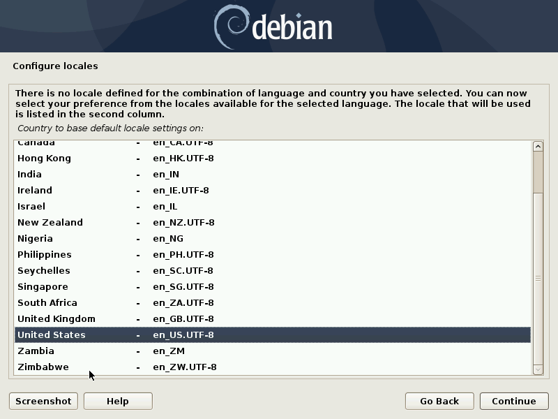

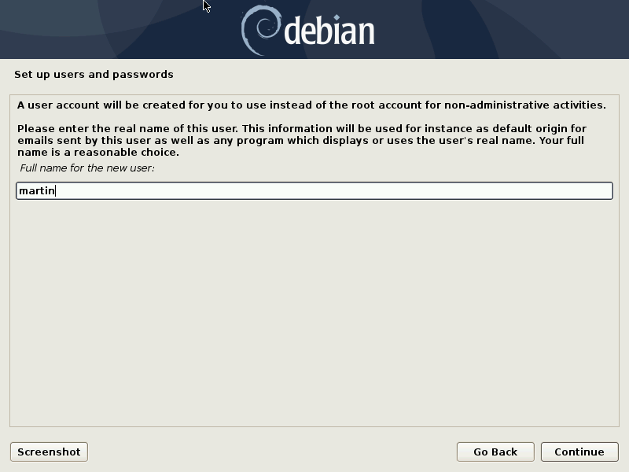

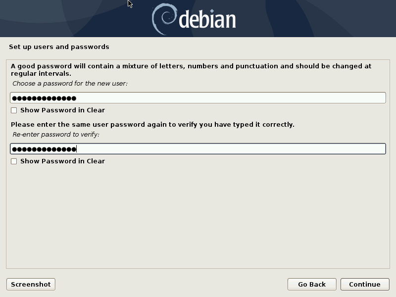

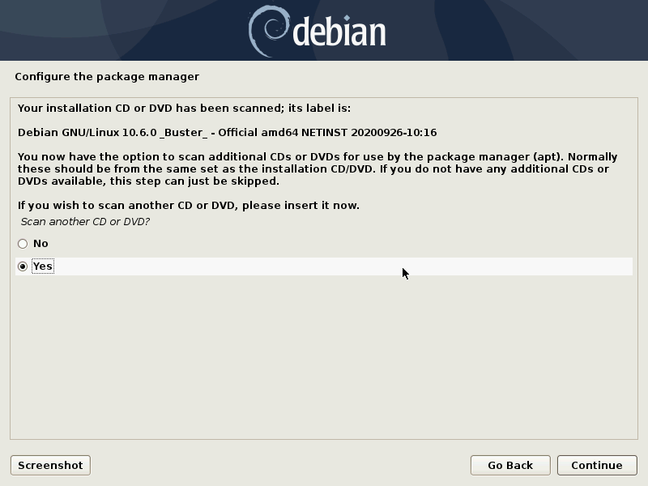

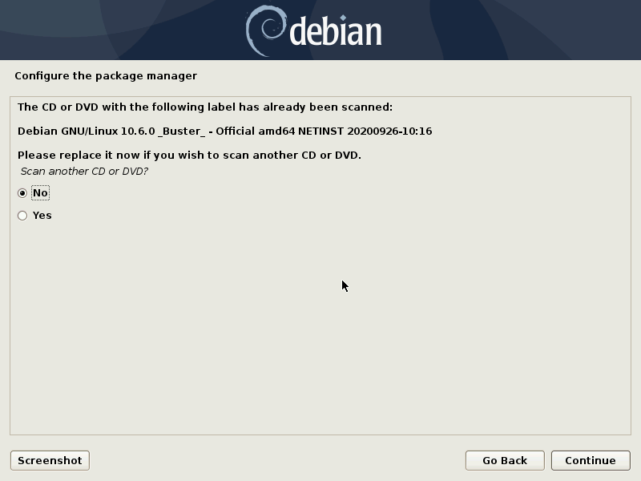

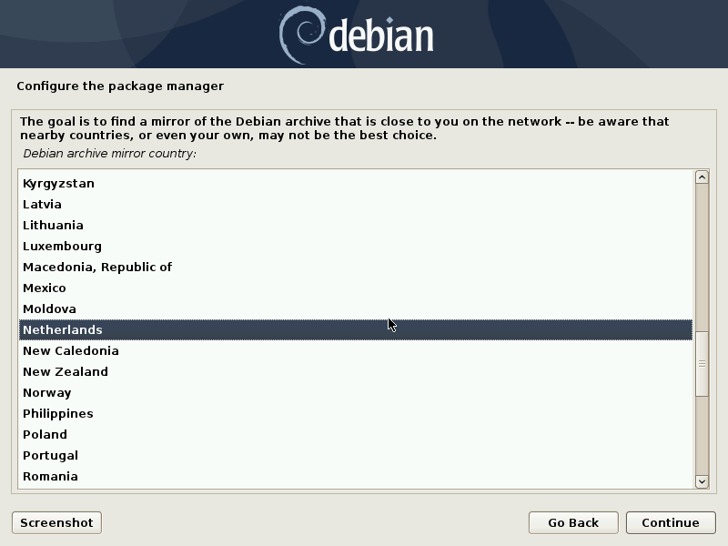

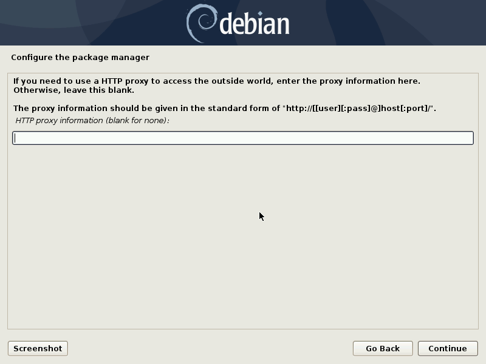

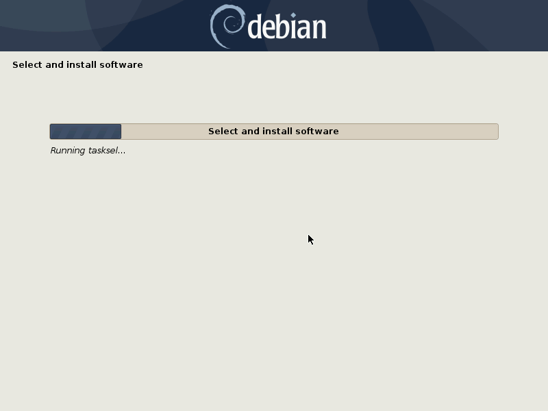

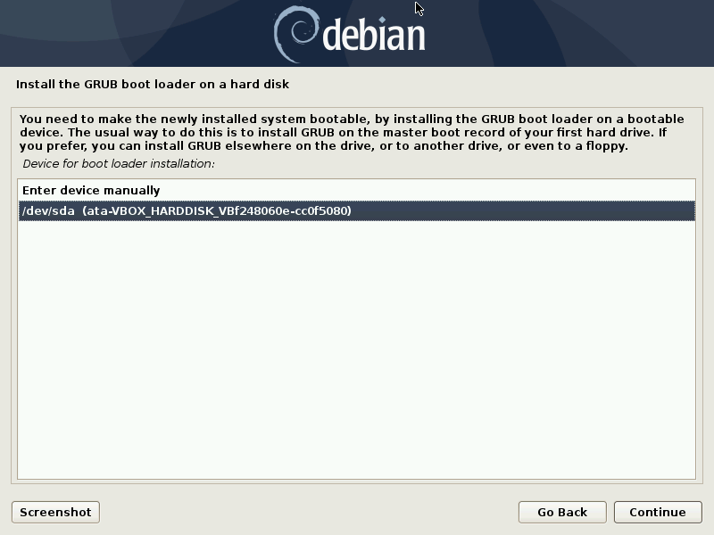

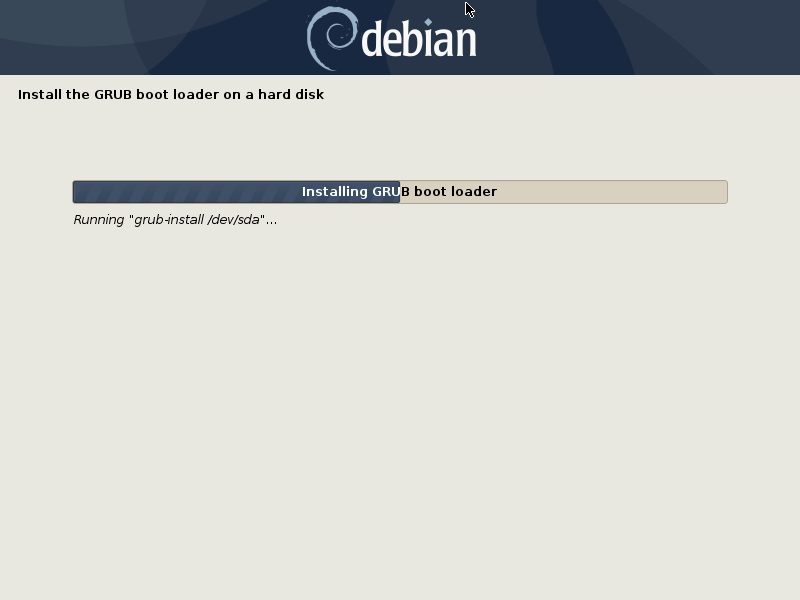

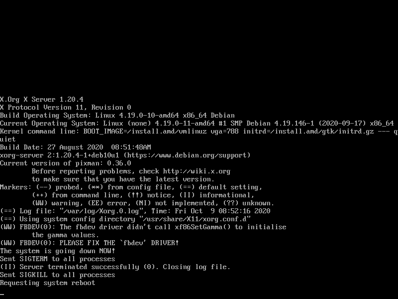

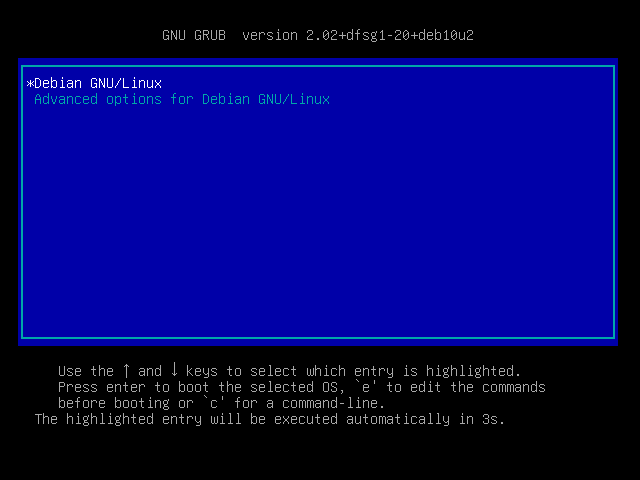

