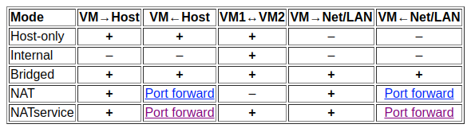

# Instellen van netwerk met Virtual Box
Een zogenaamde headless-server (een installatie zonder grafische interface/desktop) is niet altijd even 
handig om mee te werken. Typisch wil je liever niet in nano of VIM je broncode beheren. 

Daarom gaan we in deze tutorial aan de slag om Virtual Box zo in te stellen dat je er vanaf je laptop 
gebruik van kunt maken. We gaan kijken of we de volgende onderdelen van de VM op onze 
eigen laptop kunnen gebruiken:
 1. Bestandssysteem
 2. LDAP
 3. Webserver
 4. SSH toegang
 
Die laatste (SSH-toegang) is makkelijk omdat je zo makkelijker tekst kunnen kopiëren en plakken vanuit
bijvoorbeeld deze tutorials.

We gebruiken de volgende middelen op je laptop
 1. Een bestandsverkenner (Windows Verkenner of de Mac Finder)
 2. Apache Directory Studio voor LDAP (zie [deze tutorial](../ApacheLDAPStudio/README.md))
 3. Een Webbbrowser (Chromium, Chrome, Edge, Firefox etc)
 4. Een SSH client (standaard geïnstalleerd op Windows 10, Linux en Mac)
 
Eerst gaan we echter kijken naar de instellingen van het netwerk. 

## Netwerkinstellingen
Bij de instellingen van het netwerk van je VM kun je vele opties kiezen. Kijk voor een uitgebreide toelichting
bij [Oracle Virtual Box](https://www.virtualbox.org/manual/ch06.html). De meest gebruikte staan hier onder:
  1. NAT : Network Address Translation
  1. Network Bridge Adapter
  1. Host-Only Adapter
  
Op de website van Oracle staat onderstaande afbeelding.
  

Als je in je VM alleen een internet verbinding nodig hebt dan is de eerste oplossing (`NAT`) prima bruikbaar. Echter
het delen van bestanden met je Windows/MacOS/Linux-host is een probleem.

Als je thuis werkt en je router staat toe dat op jouw host-OS een VM een IP-adres krijgt, dan kun je gebruik
maken van `Network Bridge Adapter`. Je VM krijgt dan een IP-adres dat alle machines in het netwerk kunnen zien.
In wezen wordt je VM dan een server in je netwerk. Op deze manier kunnen andere apparaten (Laptop, mobiele telefoon)
gebruik maken van alle diensten (LDAP, Samba, Webserver etc) die op jouw server draaien. 

Als je bijvoorbeeld op school werkt, dan krijgt je VM van de WiFi/Router op school géén IP-adres. Als je niet 
alleen bestanden wilt downloaden of pakketten wilt bijwerken (`sudo apt update`), dan moet je een Host-Only
adapter gebruiken.

Het is een beetje proberen om te kijken wat voor jou werkt. Begin met scenario 1 als dat werkt. Wil je verder
dan kies je voor één van de andere scenario's.  

Als we kijken in welke situatie de VM zich bevindt qua netwerk dan zijn er grofweg twee situaties:
  1. de VM krijgt wel een IP-adres van de DHCP-server in het netwerk
  1. de VM krijgt geen IP-adres van de DHCP-server in het netwerk
  
In welke situatie je zit is lastig te bepalen. Je kunt dit uitproberen door te testen of je in situatie 1 
zit. Lukt dat niet, dan zit je in situatie 2.

## Port Forwarding
Je kunt in een terminal kijken wat voor IP-adres je hebt gekregen. 
```bash
martin@risksec:~$ ip addr
1: lo: <LOOPBACK,UP,LOWER_UP> mtu 65536 qdisc noqueue state UNKNOWN group default qlen 1
    link/loopback 00:00:00:00:00:00 brd 00:00:00:00:00:00
    inet 127.0.0.1/8 scope host lo
       valid_lft forever preferred_lft forever
    inet6 ::1/128 scope host
       valid_lft forever preferred_lft forever
2: enp0s3: <BROADCAST,MULTICAST,UP,LOWER_UP> mtu 1500 qdisc pfifo_fast state UP group default qlen 1000
    link/ether 08:00:27:43:e4:2c brd ff:ff:ff:ff:ff:ff
    inet 10.0.2.15/24 brd 10.0.2.255 scope global enp0s3
       valid_lft forever preferred_lft forever
    inet6 fe80::a00:27ff:fe43:e42c/64 scope link
       valid_lft forever preferred_lft forever

```
De eerste kun je negeren: dat is de localhost loopback ([uitleg](https://askubuntu.com/questions/247625/what-is-the-loopback-device-and-how-do-i-use-it)).

De tweede bevat het IP-adres `10.0.2.15` (zie de regel die begint met `inet`). Dit lokale adres is niet bruikbaar op je eigen laptop/PC 
omdat die 99,9% zeker in een andere IP-range zit. Echter, het handige is dat VirtualBox
je daar wel mee kan helpen. De VirtualBox software kan poorten doorsturen van je PC naar
de VM. Dit doe je door in de configuratie van je netwerkadapter de volgende instellingen
te kiezen:

 

Klik vervolgens op de button 'Port Forwarding' ([uitleg](https://www.howtogeek.com/122641/how-to-forward-ports-to-a-virtual-machine-and-use-it-as-a-server/)).
 
 

De poorten in de kolom `Hostpoort` gebruik je vervolgens om verbinding te maken. Als doel-
systeem gebruik je `localhost`. Dat lijkt tegenstrijdig: de machine heeft toch een IP-adres
`10.0.2.15`! Dan moet je daar toch verbinding mee maken?! Echter, VirtualBox zorgt er voor dat op
jouw localhost (`127.0.0.1`) deze poorten beschikbaar komen.

Als je goed kijkt zie je dat niet in alle gevallen de poort in de kolom `Hostpoort` en 
`Gastpoort`  gelijk zijn. Dat werkt als volgt: op je laptop instrueer je bijv. SSH dat deze
verbinding moet maken met `localhost` op poort `2222` (Hostpoort). Op je VM luistert
de SSH-server echter gewoon op poort `22` (`Gastpoort`) zoals dat hoort. Op deze manier
hoef je dus op je VM geen instellingen te veranderen met alle gevolgen van dien.

Een voorbeeld:
```bash
  c:\users\martin\> ssh -p 2222 localhost
```

Bij veel software kun je de poorten zelf wel instellen. In onze situatie is dat zo voor
 1. SSH (2222 -> 22)
 2. Apache Directory Studio (389 -> 389)
 3. Webserver (8080 -> 80)
 
Het zal je opvallen 
 
### Waarom Port-forwarding met andere poortnummers!?
Een goede vraag! Waarom niet gewoon 22, 80 en 389 ? In veel Operating Systems worden sommige poorten
al afgevangen door het Operating Systeem zelf. Zeker op MacOS en Linux zal dat het geval
zijn. Om te voorkomen dat je in de problemen komt kan het daarom handig zijn om een andere
poort te kiezen voor de `Hostpoort`. 

## Host Only Ethernet Adapter instellen  

In situatie 1 heb je een IP-adres gekregen dat alle machines in je netwerk zouden kunnen gebruiken.
Het belangrijkste is echter dat jouw laptop/PC waar de VM op draait dit IP-adres ook snapt.
Je kunt dan dus gewoon dat IP-adres gebruiken in combinatie met de juiste poort.

Als blijkt dat je niet een IP-adres van de router krijgt, dan moet je een andere oplossing zoeken. 
Je gaat dan zorgen dat VirtualBox een router wordt die jouw VM een IP-adres kan geven. Hiervoor
moet je eerst een instelling in VirtualBox aanpassen. Dit doe je door in VirtualBox 
een Host Adapter aan te maken. Open de VirtualBox manager en kies in het 
menu voor Bestand => Host Network Manager.
 

 
Er wordt een nieuw dialoogvenster geopend.   


Voeg een nieuwe configuratie door op de knop 'Create'  te drukken. Vervolgens wordt een nieuwe configuratie toegevoegd. 


Na het toevoegen kun je het nieuwe item selecteren om deze in te stellen, of de instellingen af te lezen. Let op de twee
tabbladen: één voor de algemene instellingen en één voor de DHCP-server.

Op het eerste tabblad kun je regelen welk IP-adres jouw VM moet krijgen. Dit is het IP-adres zoals het alleen door jouw
laptop/PC gezien kan worden. Het is aan te raden om hier te kiezen voor 'Handmatig adapter instellen' te kiezen, anders
moet je bijvoorbeeld voor Samba en SSH steeds checken welk nieuw IP-adres je VM op benaderd moet worden.

In onderstaande voorbeeld werk je dus met IP-adres 192.168.203.1. 
 


Vervolgens kun je bepalen of VirtualBox ook DHCP moet faciliteren. Dit is niet per sé noodzakelijk. 


## VM instellen om de nieuwe Host-Only Adapter te gebruiken.
De volgende stap is dat je bij de virtuele machine moet aangeven dat ie daadwerkelijk deze nieuwe instellingen 
moet gaan gebruiken. Open de instellingen van je VM en open het tabblad 'Netwerk'. Kies bij 'Adapter 1' (tabblad bovenin)
voor 'Gekoppeld aan Host Only Adapter'. Selecteer bij `Naam` de net nieuw aangemaakt Host Only adapter 
(`VirtualBox Host-Only Ethernet Adapter`).

Vervolgens moet je nog een geavanceerde optie instellen. Klik op het driehoekje voor `Geavanceerd` en zet bij 
`Promiscuous-modus` de optie `Alle toestaan` aan.   


Start je VM om de nieuwe instellingen te testen. Als je deze opties wijzigt terwijl je VM al draait dan kun je soms
met het commando `dhclient` de nieuwe instellingen activeren. Als dat niet werkt dan is herstarten vaak de oplossing. 

```bash
  root@risksec: dhclient
```
Soms leidt dit tot meerdere foutmeldingen die bijvoorbeeld veroorzaakt worden doordat je 
wellicht meerdere netwerkadapters geactiveerd hebt.

Check weer met het commando `ip addr` of je een bruikbaar IP-adres hebt gekregen. 

## Meerdere netwerkkaarten
Je kunt eventueel een tweede netwerkkaart aanzetten zodat je altijd, ongeacht de situatie 
waar je in zit, een werkende situatie krijgt. Dit regel je eenvoudig in de netwerk manager
van je VM. Let op: dit lukt niet als je VM al draait; deze zul je dan eerst netjes moeten
afsluiten.


Bij het opvragen van de nieuwe configuratie ziet er dan bijvoorbeeld als volgt uit:
(let op de regels die beginnen met `inet`). Je hebt nu 3 IP-adressen:
  1. 127.0.0.1 (localhost)
  1. 10.0.2.15 (via NAT-configuratie)
  1. 10.87.1.213 (via Network Bridge adapter)
  1. 192.168.203.3 (via Host Only Ethernet adapter)
  
```bash
martin@risksec:~$ ip addr
1: lo: <LOOPBACK,UP,LOWER_UP> mtu 65536 qdisc noqueue state UNKNOWN group default qlen 1
    link/loopback 00:00:00:00:00:00 brd 00:00:00:00:00:00
    inet 127.0.0.1/8 scope host lo
       valid_lft forever preferred_lft forever
    inet6 ::1/128 scope host
       valid_lft forever preferred_lft forever
2: enp0s3: <BROADCAST,MULTICAST,UP,LOWER_UP> mtu 1500 qdisc pfifo_fast state UP group default qlen 1000
    link/ether 08:00:27:43:e4:2c brd ff:ff:ff:ff:ff:ff
    inet 10.0.2.15/24 brd 10.0.2.255 scope global enp0s3
       valid_lft forever preferred_lft forever
    inet6 fe80::a00:27ff:fe43:e42c/64 scope link
       valid_lft forever preferred_lft forever
3: enp0s8: <BROADCAST,MULTICAST,UP,LOWER_UP> mtu 1300 qdisc pfifo_fast state UP group default qlen 1000
    link/ether 08:00:27:9e:3b:8e brd ff:ff:ff:ff:ff:ff
    inet 10.87.1.213/22 brd 10.87.3.255 scope global enp0s8
       valid_lft forever preferred_lft forever
    inet6 fe80::a00:27ff:fe9e:3b8e/64 scope link
       valid_lft forever preferred_lft forever
4: enp0s9: <BROADCAST,MULTICAST,UP,LOWER_UP> mtu 1500 qdisc pfifo_fast state UP group default qlen 1000
    link/ether 08:00:27:91:d7:d4 brd ff:ff:ff:ff:ff:ff
    inet 192.168.203.3/24 brd 192.168.203.255 scope global enp0s9
       valid_lft forever preferred_lft forever
    inet6 fe80::a00:27ff:fe91:d7d4/64 scope link
       valid_lft forever preferred_lft forever
martin@risksec:~$
```

#Diensten benaderen
In de volgende onderdelen gaan we kijken hoe je de diensten op je VM zoals Samba, SSH, LDAP en 
webserver kunt benaderen vanaf je eigen werkplek.

Normaal gesproken heb je drie zaken nodig om verbinding te maken
  1. de doelmachine, meestal in de vorm van een IP-adres
  1. de doelpoort waar de doelmachine het verkeer voor de bedoelde dienst op verwacht
  1. software waarmee je de taal van de dienst ('protocol') kunt praten
  

## LDAP toegang 
Om de toegang te regelen gebruiken we de software "Apache Directory Explorer". Zie voor installatie
en opzetten van de verbinding [deze tutorial](../ApacheLDAPStudio/README.md). 

Normaal gesproken is er op jouw machine (`localhost`) geen LDAP-protocol software geinstalleerd die luistert op 
poort 389. Je kunt dus veilig verbinding maken met óf `localhost:389` of `192.168.233.203:389` (of welk IP-adres)
je maar gebruikt. 

## Webserver toegang
Er is een kleine kans dat jouw Windows/Linux/MacOS installatie misschien al een webserver heeft draaien op poort 80 of
dat je OS deze poort standaard blokkeert.
Als je gebruik maakt van `localhost` met port-forwarding (in plaats van een echt IP-adres via router of 
Host-Only Adapter) dan zul je dus waarschijnlijk een andere poort dan 80 moeten gebruiken. Meestal kiezen we dan 
voor poort 8080.

In de hosts-file van je host-OS (Windows/MacOS/Linux) moet je dan wel de juiste aanpassing doen. Typisch staat deze 
hosts file op onderstaande locaties:
   1. Windows: `c:\windows\system32\drivers\etc\hosts`
   2. Linux: `/etc/hosts`

Let op dat je vaak admin/root rechten nodig hebt om dit bestand aan te passen.

Deze aanpassing is nodig om te zorgen dat jouw VM en Apache2 die daar op draait weet welke configuratie gebruikt
moet worden.

### Netwerk via NAT
Maak een vermelding in je hosts-file op onderstaande manier. 
```text
  127.0.0.1 mijnwebsite.local     
```
Open vervolgens jouw URL met een vermelding van poort 8080:

`http://mijnwebsite.local:8080`

### Network bridged of Host-Only Adapter
Als je een Network bridged of Host-Only Adapter configuratie gebruikt, hoef je geen port-forwarding te gebruiken. 
Je kunt dan het echte IP-adres gebruiken, en hoeft dan geen poort 8080 te gebruiken.

```text
  192.168.233.203 mijnwebsite.local     
```

Open vervolgens jouw URL:

`http://mijnwebsite.local`

## SSH toegang
Er is een kleine kans dat jouw Windows/Linux/MacOS installatie misschien al een SSH-server heeft draaien op poort 22. 

### Netwerk via NAT
Als je gebruik maakt van `localhost` met port-forwarding (in plaats van een echt IP-adres via router of 
Host-Only Adapter) dan zul je dus waarschijnlijk een andere poort dan 22 moeten gebruiken. Meestal kiezen we dan 
voor poort 2222.

Je logt dan in via onderstaande commando (`-p` geeft aan dat je een andere poort wilt aanduiden dan de standaard 
poort 22). Bijvoorbeeld via Windows 10 command line.

```text 
  c:\users\martin> ssh martin@localhost -p 2222
```

### Network bridged of Host-Only Adapter
Als je een Network bridged of Host-Only Adapter configuratie gebruikt, hoef je geen port-forwarding te gebruiken. 
Let op dat je in onderstaande dus een ander IP-adres gebruikt!

```text 
  c:\users\martin> ssh martin@192.168.233.203
```


**Let op**: standaard staat SSH meestal niet toe dat je met een `root`-account kunt inloggen. Je kunt dit oplossen door
1. de configuratie van SSH-server te veranderen
2. een aparte user te gebruiken en deze `sudo`-rechten te geven; in de standaard setup van Debian moet je zo'n extra
gebruiker al aanmaken. 

Met onderstaande commando (ingelogd als `root`) 
```bash
root@risksec:~# addgroup martin sudo
```
Let op: groepsrechten worden alleen geactiveerd na inloggen. Mogelijk moet je dus opnieuw inloggen als gebruiker 
`martin`.

Onderstaande als gebruiker `martin`:
```bash
martin@risksec:~$ whoami
martin
martin@risksec:~$ sudo -i
root@risksec:~# whoami
root
root@risksec:~# apt update
......
root@risksec:~# exit
martin@risksec:~$ whoami
martin
martin@risksec:~$ sudo apt update 
.......
```

Deze gebruiker (`martin` in bovenstaande voorbeeld) krijgt zo de mogelijk om tijdelijk 'elevated rights' te krijgen 
door `sudo` voor een commando te zetten, of tijdelijk `root` te zijn door `sudo -i` te geruiken.

## Bestanden benaderen op de VM
Het benaderen van bestanden op je VM is eigenlijk de lastigste: je kunt je bestandbeheer applicatie 
(MacOS Finder, Windows Verkenner) vaak niet instrueren om dat over een andere poort te doen. Dat betekent
 dat je dus eigenlijk altijd de standaard poort moet gebruiken (445). 

Dit impliceert dat je dus óf een IP-adres van je echte router moet hebben (**Network Bridge Adapter**) óf 
een IP-adres via de **Host-Only Adapter**.

Daarna kun je bijvoorbeeld in Windows je machine als volgt benaderen:

`\\192.168.203.3\martin`

Zie voor een uitgebreide uitleg de [Samba](../Samba/README.md) uitleg.  
