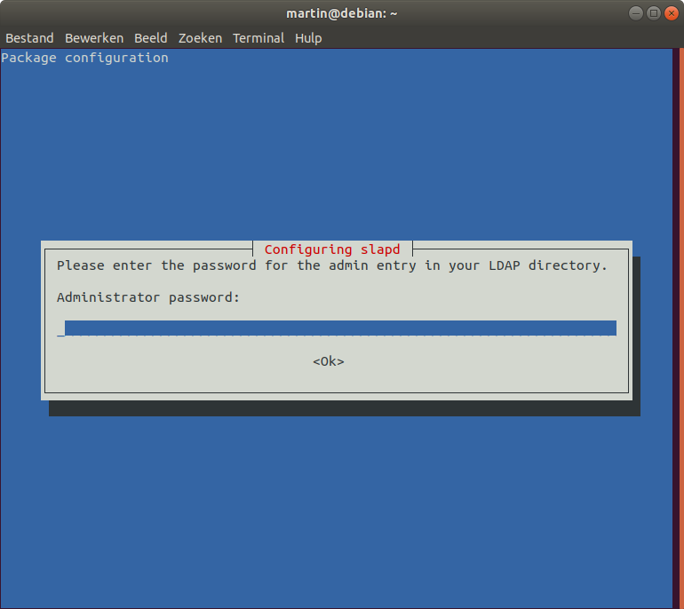
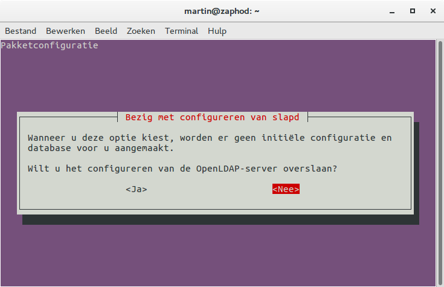

# OpenLDAP installatie en configuratie.
Het OpenLDAP product geeft ons de mogelijkheid om gebruikers veilig te administreren. Deze gebruikers kunnen we dan 
autoriseren voor bijvoorbeeld onze webserver. We gebruiken hier (minimaal) versie 2.4.

Zorg dat je bent ingelogd via `root` of een gebruiker met `sudo`-rechten. Onderstaande gaat uit van de laatste (een normale)
gebruiker die via `sudo` tijdelijk verhoogde rechten krijgt. 

## Installatie Apache & OpenLDAP  
```bash
martin@debian:~$ sudo apt install slapd ldap-utils
Reading package lists... Done
Building dependency tree       
Reading state information... Done
The following additional packages will be installed:
  libltdl7 libodbc1 psmisc
Suggested packages:
  libsasl2-modules-gssapi-mit | libsasl2-modules-gssapi-heimdal libmyodbc odbc-postgresql tdsodbc unixodbc-bin
The following NEW packages will be installed:
  ldap-utils libltdl7 libodbc1 psmisc slapd
0 upgraded, 5 newly installed, 0 to remove and 0 not upgraded.
Need to get 2,375 kB of archives.
After this operation, 18.5 MB of additional disk space will be used.
Do you want to continue? [Y/n] 

```
Accepteer eventuele gesuggereerde pakketten en start de installatie. Je moet tijdens deze installatie een wachtwoord invoeren 
en bevestigen. DIt is het administrator wachtwoord voor **LDAP** dat je goed moet onthouden (**schrijf dit op!**)
.

# Configureren OpenLDAP
Na afloop van de installatie moeten we de OpenLDAP nog wel verder configureren. Dat doen we met onderstaande commando:
```bash
martin@debian:~$ sudo dpkg-reconfigure slapd
```

Je krijgt een aantal vragen te zien zoals weergegeven in onderstaande afbeeldingen. Neem de instellingen over.

Eerst moet je aangeven dat je deze wizard gaat gebruiken voor het opzetten van een eerste installatie. Kies hier 
dus voor `<Nee>`.



Voer nu de gewenste domeinnaam in. Dit is typisch een domeinnaam die nauw verwant is aan je project. Het is handig
om deze te laten eindigen op `.local`.  


Voer hier het wachtwoord in dat je tijdens de installatie hebt opgegeven.


Kies bij het database type voor `MDB`.


Kies voor `<Nee>`  om het verouderde LDAP-protocol versie 2 NIET toe te staan.
 


## Testen OpenLDAP
Om wat testen te kunnen doen kunnen we zowel bash-commando's gebruiken, óf een GUI. 
In het eerste geval gebruik je de command-line van je VM met onderstaande commando's: 

```bash
$ ldapsearch -s sub -x -b "" -s base supportedfeatures
# extended LDIF
#
# LDAPv3
# base <> with scope baseObject
# filter: (objectclass=*)
# requesting: supportedfeatures 
#

#
dn:
supportedFeatures: 1.3.6.1.1.14
supportedFeatures: 1.3.6.1.4.1.4203.1.5.1
supportedFeatures: 1.3.6.1.4.1.4203.1.5.2
supportedFeatures: 1.3.6.1.4.1.4203.1.5.3
supportedFeatures: 1.3.6.1.4.1.4203.1.5.4
supportedFeatures: 1.3.6.1.4.1.4203.1.5.5

# search result
search: 2
result: 0 Success

# numResponses: 2
# numEntries: 1

```
