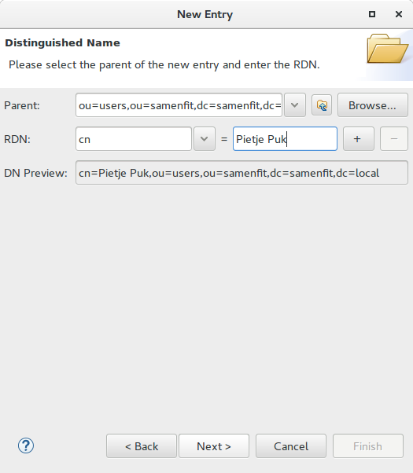
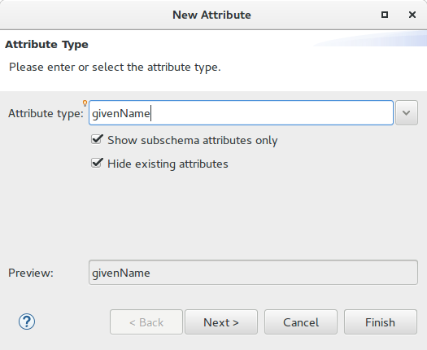
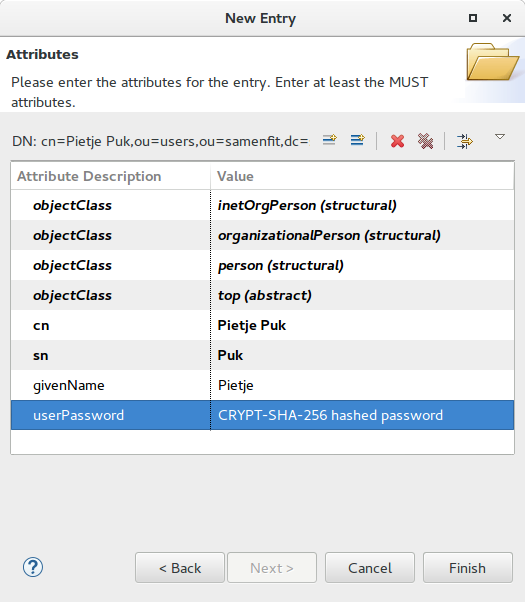

# OpenLDAP installatie en configuratie.
Het OpenLDAP product geeft ons de mogelijkheid om gebruikers veilig te administreren. Deze gebruikers kunnen we dan 
autoriseren voor bijvoorbeeld onze webserver. 

## Installatie Apache & OpenLDAP  
```bash
$ sudo apt install slapd
```
Accepteer eventuele gesuggereerde pakketten en start de installatie. 

# Configureren OpenLDAP
Na afloop van de installatie moeten we de OpenLDAP nog wel verder configureren. Dat doen we met onderstaande commando:
```bash
$ sudo dpk-reconfigure slapd
```

Je krijgt een aantal vragen te zien zoals weergegeven in onderstaande afbeeldingen. Neem de instellingen over.


## Testen OpenLDAP
Om wat testen te kunnen doen kunnen we zowel bash-commando's gebruiken, óf een GUI. In het eerste geval gebruik je 

```bash
$ sudo apt install ldap-utils
$ ldapsearch -s sub -x -b "" -s base supportedfeatures
# extended LDIF
#
# LDAPv3
# base <> with scope baseObject
# filter: (objectclass=*)
# requesting: supportedfeatures 
#

#
dn:
supportedFeatures: 1.3.6.1.1.14
supportedFeatures: 1.3.6.1.4.1.4203.1.5.1
supportedFeatures: 1.3.6.1.4.1.4203.1.5.2
supportedFeatures: 1.3.6.1.4.1.4203.1.5.3
supportedFeatures: 1.3.6.1.4.1.4203.1.5.4
supportedFeatures: 1.3.6.1.4.1.4203.1.5.5

# search result
search: 2
result: 0 Success

# numResponses: 2
# numEntries: 1

```

Testen door middel van een GUI gaat met de Apache Directory Studio. Je kunt deze op je Windows PC installeren of op je virtuele machine. Als je via je WIndows PC naar de LDAP-service wilt verbinden, zorg dan dat je Port-forwarding aanzet voor poort 389 op je VM-configuratie

[Apache Directory Studio](https://directory.apache.org/studio/downloads.html)

Voor een installatie handleiding klik je [hier](../ApacheLDAPStudio). 

## Opvoeren gebruikers en groepen - OrganizationalUnit
Het is niet gebruikelijk om de in root van je LDAP-tree meteen gebruikers en groepen te maken. Dus maak eerst OrganisationalUnits (OU) . Bijvoorbeeld een OU voor de interne organisatie. 

Ga naar het menu, dan `LDAP` en `New Entry`. Zorg dat de root-node `dc=Samenfit,dc=local` geselecteerd is.  Doorloop de wizard en vul de juiste gegevens in:


Type bij `Available object classes` de tekst `Org` en er verschijnt een verkorte lijst. Kies voor `organizationalUnit` en klik op de `Add` button. 


Het scherm ziet er dan uit zoals hier onder. Klik op `Next` om verder te gaan. We gaan nu de attributen invullen. Elk object heeft een attribuut dat bepaald hoe het in de tree geplaatst moet worden. We noemen dit de [RDN](https://ldap.com/ 


Herhaal deze stappen voor het aanmaken van een ORganizationalUnit voor de Users:

`ou=users, dc=samenfit,dc=local`

## Opvoeren gebruikers en groepen - usergroups
Om rechten uit te geven is het vaak handig om gebruikers in groepen op te nemen. De volgende stap is dus het aanmaken van een gebruikersgroep.  Hiervoor maken we eerst op een wat slimmere manier een nieuwe OU. 

Selecteer eerst de eerder gemaakte OU en klik met de rechter muisknop op deze OU, en kies uit het lokale menu 'New Entry':


Merk op dat we nu een template gebruiken van de zojuist geselecteerde OU. Nu kunnen we sneller door de wizard heen. 


Vergeet niet de RDN aan te passen! Noem deze OU `groups`. 


Klik op `Finish` om de wizard af te ronden. 

## Aanmaken groep 
De volgende stap is het maken van een Groep. 


In het laatste scherm laten we het attribuut `uniqueMember` voorlopig leeg.


## Maken van een gebruiker
We gaan nu een nieuwe gebruiker aanmaken. We maken een gebruiker door een object te maken van de 
`objectClass = inetOrgPerson`. Belangrijk om te weten is dat we na afloop van het doorlopen van de wizard
nog een aantal extra attributen moeten aanmaken, te weten:
  * `userPassword` : het wachtwoord
  * `uid`: de gebruikersnaam
  * `sn`: de achternaam (`surname`)
  
Als RDN gebruiken we het attribuut `CN` (CanonicalName). Selecteer eerst de juiste plek om de gebruiker 
aan te maken: 


We krijgen dan de volgende informatie:
   




Je kunt eventueel nog de givenNaam (voornaam) invoeren. Je doet dit door met de rechtermuisknop in de lijst
met attributen te klikken, en dan te kiezen voor `New Attribute`.  

Daarna voeren we het attribuut `userPassword` op. Na het aanmaken krijg je meteen een dialoogvenster om het wachtwoord in te voeren.







## Koppelen gebruikers aan groep
Nu we gebruikers hebben gemaakt, kunnen we ze aan groepen koppelen. We gebruiken het attribuut `uniqueMember`
dat een zogenaamd `multivalue` attribuut is. Dat betekent dat het vaker mag voorkomen bij een object. Handig!
Zo kunnen we dus eenvoudig meerdere gebruikers in een groep koppelen. 

Dat gaat vrij eenvoudig:
  1. ga naar de DIT (Directory information tree) links
  2. selecteer de gebruiker die je in een groep wilt toevoegen
  3. kopieer deze gebruiker (met bijv. Ctrl+C)
  4. selecteer de groep waar je deze gebruiker aan wilt toevoegen
  5. selecteer het lege attribuut `uniqueMember`
  6. druk op plakken, en zie dat de `DN` (DistinguishedName) tevoorschijn komt.
  7. Druk op `Enter` om te bevestigen
  
Wil je nog een gebruiker toevoegen? Herhaal dan stappen 1 t/m 4. Ga vervolgens hieronder verder:
  1. selecteer het attribuut `uniqueMember`
  2. ga naar het menu-->LDAP-->Add value , of gebruik de rechter muisknop op het attribuut `uniqueMember`
  en kies  `Add Value`.
  3. plak de `DN` in het nieuwe attribuut.
  
  
Uiteindelijk ziet dat er als volgt uit:


Maak nu meerdere gebruikers aan en stop deze in de juiste groepen. Het idee is dat je op basis van groepen
andere toegangsrechten in je website / Apache Webserver kunt toekennen.


# Referenties
  * [LDAP](https://ldap.com]) 
  * [LDAP Password encryptie & Apache WebServer](https://httpd.apache.org/docs/2.4/misc/password_encryptions.html)
