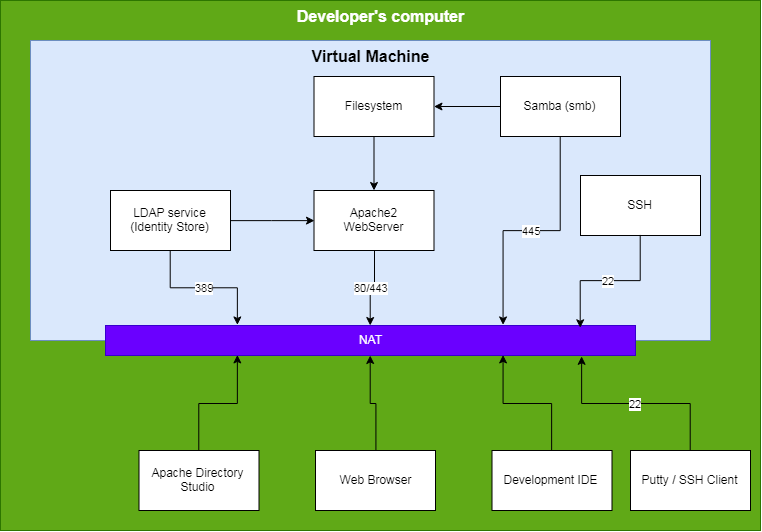

# SecurityAndRiskProject

In dit project gaan we aan de slag met Linux (bijv. Ubuntu), Apache en LDAP. Het hoofdproduct van dit project is een website die we gaan beveiligen op meerdere manieren:
  * Operating Systeem
  * File Systeem
  * Database
  * Authenticatie / Autorisatie

We gebruiken hiervoor de volgende producten:
  * OpenLDAP
  * Apache 2 webserver
  
VOor het beheren van de LDAP-entiteiten gebruiken we Apache Directory Studio. 

De verschillende handleidingen voor installatie en configuratie zijn te vinden in onderstaande locaties. Deze kunnen
het beste in onderstaande volgorde doorlopen worden:
  1. [Installatie OpenLDAP](./OpenLDAP/README.md)
  1. [Installatie Apache Directory Studio](./ApacheLDAPStudio/README.md)
  1. [Installatie Apache Webserver](./ApacheWebServer/README.md)
  
Uiteindelijk kun je onderstaande landschap inrichten:

  

## PHP & LDAP
Mocht je met LDAP en PHP aan de slag willen dan moet je gebruik maken van de PHP [LDAP module](http://php.net/manual/en/book.ldap.php).

  * Maak eerst verbinding met [ldap_connect](http://php.net/manual/en/function.ldap-connect.php)
  * Doe een [ldap-bind](http://php.net/manual/en/function.ldap-bind.php) met de juiste
    * Username
    * Password
  * Voer een LDAP-query uit met bijv. [ldap_search](http://php.net/manual/en/function.ldap-search.php)
  * Haal de gevonden items op met [ldap_get_entries](http://php.net/manual/en/function.ldap-get-entries.php)
  
In de voorbeelden van de hiervoor genoemde URL's van de PHP.net handleidingen staan verder uitgewerkte voorbeelden. 

**Let op**: Zorg dat (als dat nodig is) je de LDAP-protocol versie op 3 zet! Immers, bij de installatie van de OpenLDAP
server heb je V2-protocol niet geactiveerd. Dergelijke aanpassingen doe je na de `ldap_connect` en vóór de `ldap_bind`. 

Een voorbeeld:
```php
    $ldapconn = ldap_connect("ldap.example.com")
                or die("Could not connect to LDAP server.");
    
    if ($ldapconn) {
        // set protocol version to 3
        ldap_set_option($ldapconn, LDAP_OPT_PROTOCOL_VERSION, 3);
        
        // binding to ldap server
        $ldapbind = ldap_bind($ldapconn, $ldaprdn, $ldappass);
        
        // verify binding
        if ($ldapbind) {
            echo "LDAP bind successful...";
            
        } else {
            echo "LDAP bind failed...";
        }
        
    }
  
```

**Let op**: ALs je heel veel gebruikers hebt, of gebruikers in een groep, dan kan het zijn dat resultaten gepagineerd
opgeleverd worden. Kijk in dat geval eens bij [dap_control_paged_result_response](http://php.net/manual/en/function.ldap-control-paged-result-response.php).
   

Martin Molema

mail: [martin.molema@nhl.nl](mailto:martin.molema@nhl.nl)

8-2-2019
  
