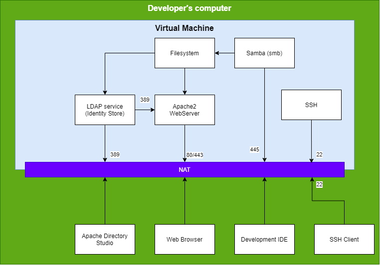

# SecurityAndRiskProject

In dit project gaan we aan de slag met Linux (bijv. Ubuntu), Apache en LDAP. Het hoofdproduct van dit project is een website die we gaan beveiligen op meerdere manieren:
  * Operating Systeem
  * File Systeem
  * Database
  * Authenticatie / Autorisatie

We gebruiken hiervoor de volgende producten:
  * OpenLDAP
  * Apache 2 webserver
  
VOor het beheren van de LDAP-entiteiten gebruiken we Apache Directory Studio. 

De verschillende handleidingen voor installatie en configuratie zijn te vinden in onderstaande locaties. Deze kunnen
het beste in onderstaande volgorde doorlopen worden:
  1. [Installatiehandleiding Debian]( ./DebianInstall/README.md )
  1. [Ophalen van bestanden](./GIT/README.md)
  1. [Installatie OpenLDAP](./OpenLDAP/README.md)
  1. [Installatie Apache Directory Studio](./ApacheLDAPStudio/README.md)
  1. [Configuratie gebruikers en groepen in LDAP](./ConfigLDAP/README.md)
  1. [Installatie Apache Webserver](./ApacheWebServer/README.md)
  1. [Installatie PHP](./php/README.md)
  1. [Netwerk instellen](./Netwerk/README.md)
  
Uiteindelijk kun je onderstaande landschap inrichten:

  

Martin Molema

mail: [martin.molema@nhlstenden.com](mailto:martin.molema@nhlstenden.com)

Laatste update op 11-maart-2020
  
